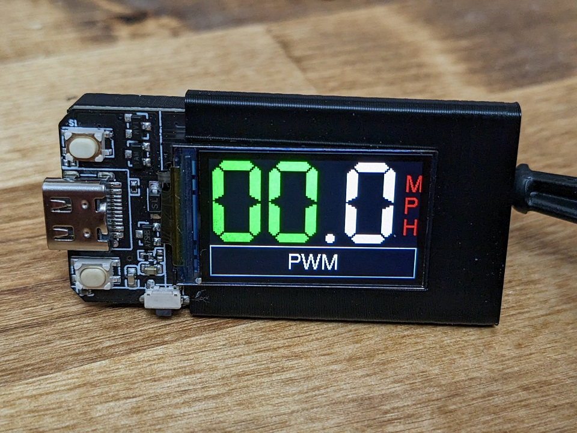

# Monocle
A ESP32 display for Electric Unicycles for stats like speed and Duty Cycle

It is designed to run on the TTGO T-Display (Series	Q125 with 16Mb)
 

Runs on this board
https://www.amazon.com/dp/B099MPFJ9M (get the 16M CH9102F)

Get slower shipping but a better price here:
https://www.lilygo.cc/products/lilygo%C2%AE-ttgo-t-display-1-14-inch-lcd-esp32-control-board (get the T-Display 16M [Q125])

Nothing to connect or solder
 
Gets about 5 updates per second from my Sherman Max

The display is outputting about 60 FPS

The main screen show both Speed and Duty Cycle.

Flash your board here:
https://mac-o-war.github.io/Monocle/flash.html
